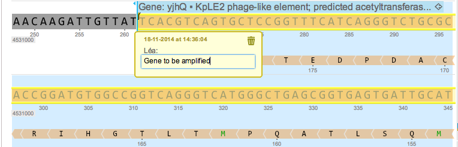

-   Add a comment to the part (Figure [2.2.2.1](#x1-103001r1)) by right
    clicking on the part and selecting ”Add comment” in the drop down
    menu (see section [1.10](#x1-480001.10)).

    ------------------------------------------------------------------------

    

    
    
    

    Figure 2.2.2.1: Comment on the yjhQ gene.

    

    

    ------------------------------------------------------------------------
