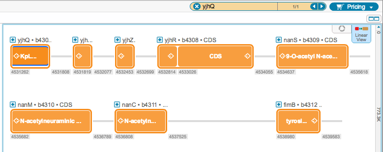

-   Find your gene of interest. This can be done:
    -   via our NCBI search tool (see section [1.8](#x1-390001.8))
    -   by finding information about the gene location in an article and
        using our ”Go to” feature (see section [1.5](#x1-310001.5))
    -   by using our project search tool (see
        section [1.7](#x1-370001.7))
    -   or by importing a file (see section [1.3](#x1-170001.3))
-   In this example, the yjhQ gene is found via the project search tool
    (Figure [2.2.1.1](#x1-102001r1)).

    ------------------------------------------------------------------------

    

    
    
    

    Figure 2.2.1.1: The
    yjhQ gene.

    

    

    ------------------------------------------------------------------------
