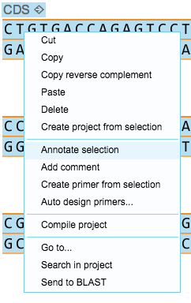

-   To annotate a sequence, go to the DNA view, select it, right click
    and select ”Annotate selection” from the drop down menu
    (Figure [2.1.2.1](#x1-99001r1)).

    ------------------------------------------------------------------------

    

    
    
    

    Figure 2.1.2.1: ”Annotate selection” from the right click drop down
    menu.

    

    

    ------------------------------------------------------------------------

-   A new part will be created from your selection. It will be set as a
    CDS by default. You can change the feature key as described above.
