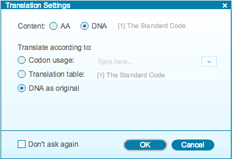
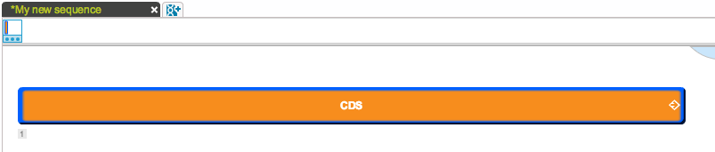
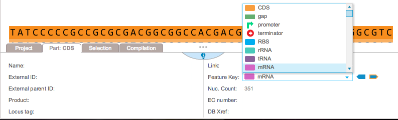

-   Paste your sequence into a new project. The ”Translation Settings”
    dialog (Figure [2.1.1.1](#x1-98001r1)) will pop up. Choose the
    appropriate option. In the example below, the DNA is kept as
    original. You can find more information about the translation
    feature in section [1.14](#x1-680001.14).

    ------------------------------------------------------------------------

    

    
    
    

    Figure 2.1.1.1: The
    “Translation Settings” dialog.

    

    

    ------------------------------------------------------------------------

-   The whole sequence will be set as CDS by default
    (Figure [2.1.1.2](#x1-98002r2)).

    ------------------------------------------------------------------------

    

    
    
    

    Figure 2.1.1.2: The
    sequence set as CDS.

    

    

    ------------------------------------------------------------------------

-   To change the feature key, go to the ”Part” tab at the bottom of the
    screen and select a feature from the ”Feature key” drop down menu
    (Figure [2.1.1.3](#x1-98003r3)).

    ------------------------------------------------------------------------

    

    
    
    

    Figure 2.1.1.3: The
    ”Feature Key” drop down menu in the ”Part” tab.

    

    

    ------------------------------------------------------------------------
