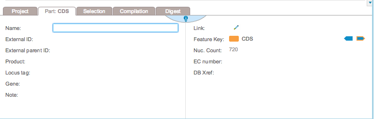

-   To rename a part, type in a name in the ”Name” section of the ”Part”
    tab (Figure [2.1.3.1](#x1-100001r1)).

    ------------------------------------------------------------------------

    

    
    
    

    Figure 2.1.3.1: The
    ”Name” section in the ”Part” tab.

    

    

    ------------------------------------------------------------------------
