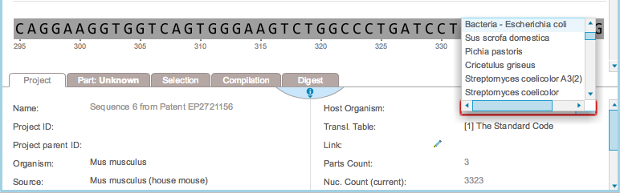
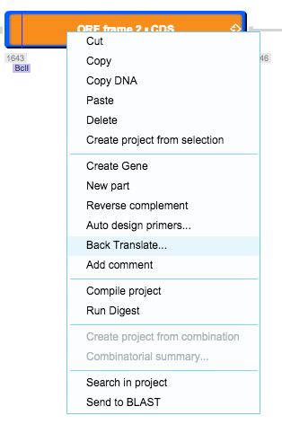

-   To back translate a whole project, go to the “Project” tab
    (Figure [1.14.1.1](#x1-69001r1)) at the bottom of the opened
    project. You can select the appropriate host organism and
    translation table from the ‘Translation Settings’ dialog which will
    appear upon selecting the host organism.

    ------------------------------------------------------------------------

    

    
    
    

    Figure 1.14.1.1: The
    ”Project” tab.

    

    

    ------------------------------------------------------------------------

-   To back translate a part or a gene, right click on it and select
    “Back Translate…” (Figure [1.14.1.2](#x1-69002r2)). This will take
    you to the “Translation Settings” dialog
    (Figure [1.14.2.2](#x1-70003r2)).

    ------------------------------------------------------------------------

    

    
    
    

    Figure 1.14.1.2: ”Back
    Translate...” in the right click drop down menu.

    

    

    ------------------------------------------------------------------------

-   Dragging and dropping sequence, or copying and pasting sequence from
    outside the project will also prompt the ”Translation Settings”
    dialog (Figure [1.14.2.2](#x1-70003r2)).
