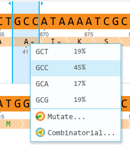
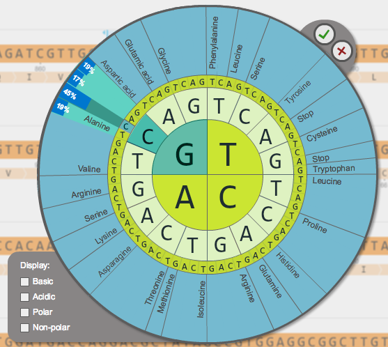

-   After a back translation, the percentages of each triplet for the
    organism are shown in the amino acid drop down menu
    (Figure [1.14.3.1](#x1-71001r1)) as well as in the amino acid
    combinatorial wheel (Figure [1.14.3.2](#x1-71002r2)) and the amino
    acid mutation wheel.

    ------------------------------------------------------------------------

    

    
    
    

    Figure 1.14.3.1: Percentages in the amino acid drop down menu.

    

    

    ------------------------------------------------------------------------

    ------------------------------------------------------------------------

    

    
    
    

    Figure 1.14.3.2: Percentages shown in the amino acid combinatorial
    wheel.

    

    

    ------------------------------------------------------------------------
