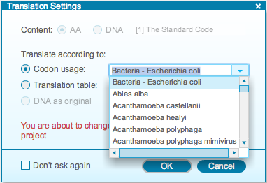
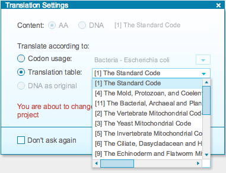
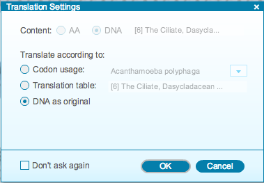

-   You can translate according to codon usage or to a translation table
    (Figure [1.14.2.2](#x1-70003r2)). For codon usage, select the
    appropriate organism from the drop down menu. Similarly, you can
    select the appropriate translation table from the corresponding drop
    down menu.

    ------------------------------------------------------------------------

    

    
    
     Codon
    usage.  

    
     Translation
    table.\

    

    Figure 1.14.2.2: The
    “Translation Settings” dialog.

    

    

    ------------------------------------------------------------------------

-   In the case of translation of a strand of DNA, you can also choose
    to keep the DNA as original (Figure [1.14.2.3](#x1-70004r3)).

    ------------------------------------------------------------------------

    

    
    
    

    Figure 1.14.2.3: The
    “Translation Settings” dialog: keep the DNA as original.

    

    

    ------------------------------------------------------------------------

-   Once you click the “Don’t ask again” box, translation will occur
    automatically according to your settings when you drag and drop or
    copy and paste a sequence.
