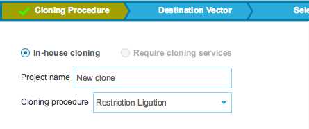

-   Type in a ”Project name”. ”Restriction Ligation” is selected as
    ”Cloning procedure” (Figure [1.19.2.1](#x1-88001r1)). More cloning
    procedure as well as the ”Require cloning services” option will be
    available soon.

    ------------------------------------------------------------------------

    

    
    
    

    Figure 1.19.2.1: The
    ”Cloning Procedure” tab.

    

    

    ------------------------------------------------------------------------
