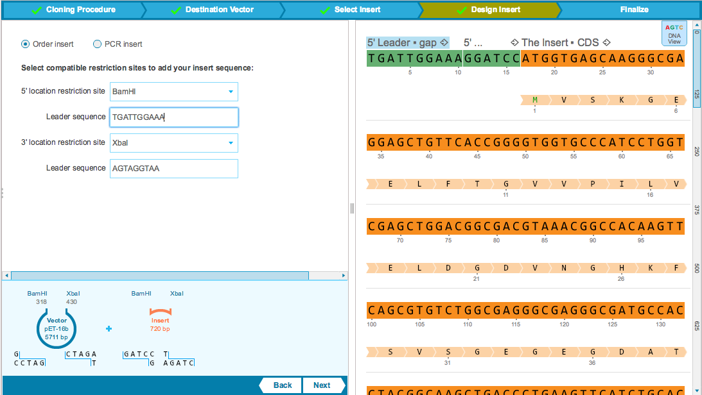

-   Flanking sticky ends can be added to the ends of the insert sequence
    by adding a ”5’ location restriction site” and a ”3’ location
    restriction site.” The drop down menu of restriction sites consists
    of a smart list of enzymes, filtered according to compatible sticky
    ends to those prior selected in the destination vector. An optional
    ”Leader sequence” can be added to ensure efficiency during
    restriction enzyme digestion (Figure [1.19.7.1](#x1-93001r1)).
-   As the flanking sequences are selected, they are added on either end
    of the insert sequence in the right panel. The insert sequence in
    the right panel is editable.

    ------------------------------------------------------------------------

    

    
    
    

    Figure 1.19.7.1: The
    ”Design Insert” tab: order insert.

    

    

    ------------------------------------------------------------------------

   