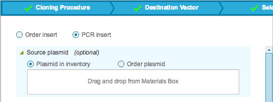
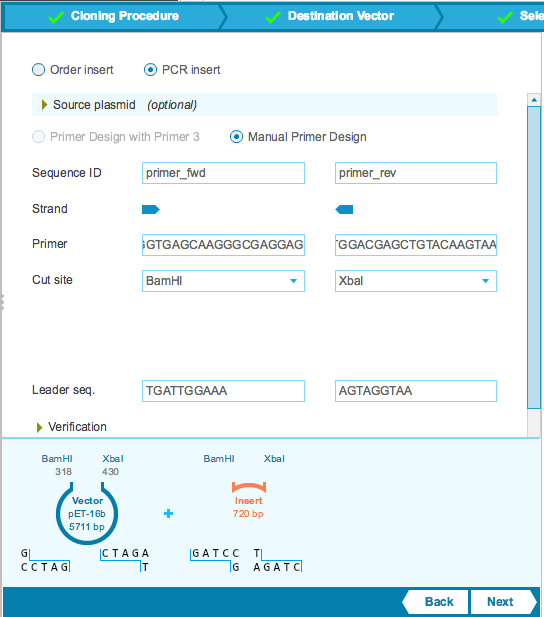
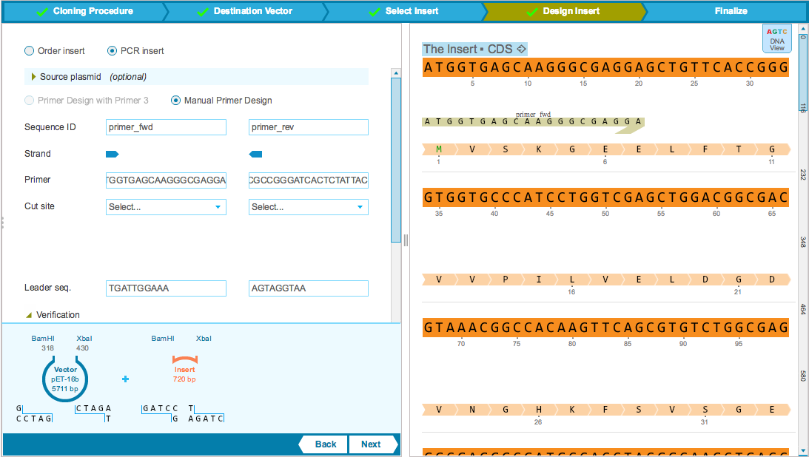
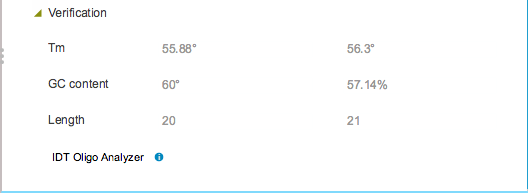

-   If you decide to PCR your insert, then you can design PCR primers
    with compatible sticky ends for amplifying your vector from the
    source plasmid. When you require a source plasmid, you can use a
    plasmid from your inventory or order a plasmid. Check the
    appropriate checkbox according to your choice. The vector will then
    be automatically added to the cart in the next step. To add the
    plasmid, drag and drop a file from the Materials box
    (Figure [1.19.8.1](#x1-94001r1)).

    ------------------------------------------------------------------------

    

    
    
    

    Figure 1.19.8.1: The
    ”Source plasmid” drop down in the ”Design Insert” tab.

    

    

    ------------------------------------------------------------------------

-   For manual design of primers fill in all the fields like the regular
    primer dialog flow (Figure [1.19.8.2](#x1-94002r2)). The drop down
    menu for cut sites again consists of a smart list of enzymes,
    filtered according to compatible sticky ends to those prior selected
    in the destination vector. If the leader sequence adds a restriction
    site then you will be warned.

    ------------------------------------------------------------------------

    

    
    
    

    Figure 1.19.8.2: The
    ”Design Insert” tab: design primers.

    

    

    ------------------------------------------------------------------------

-   Selected sites and primer sequences are highlighted on the plasmid
    on the right panel (Figure [1.19.8.3](#x1-94003r3)) and in the
    cloning minimap at the bottom of the left panel.

    ------------------------------------------------------------------------

    

    
    
    

    Figure 1.19.8.3: The
    ”Design Insert” tab: design primers.

    

    

    ------------------------------------------------------------------------

-   The ”Verification” drop down displays information about your primers
    (Figure [1.19.8.4](#x1-94004r4)).

    ------------------------------------------------------------------------

    

    
    
    

    Figure 1.19.8.4: The
    ”Verification” drop down in the ”Design Insert” tab.

    

    

    ------------------------------------------------------------------------
