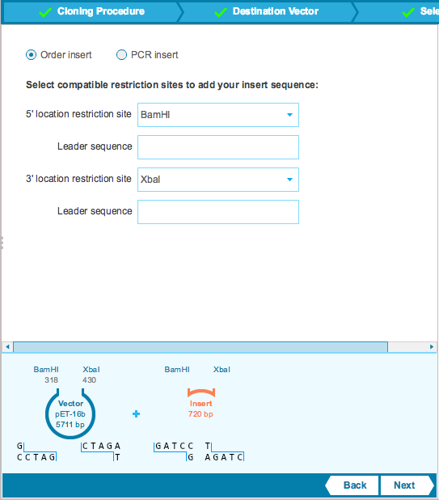

-   The ”Design Insert” step defines how the insert sequence is
    retrieved, either by submitting an ”Order” from a DNA synthesis
    provider or choosing to ”PCR the insert” out from a source plasmid.
    Select the option you would like to use by checking its checkbox
    (Figure [1.19.6.1](#x1-92001r1)).

    ------------------------------------------------------------------------

    

    
    
    

    Figure 1.19.6.1: The
    ”Design Insert” tab.

    

    

    ------------------------------------------------------------------------

   