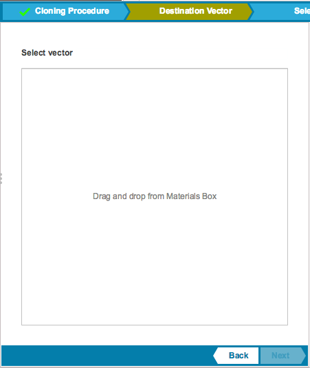
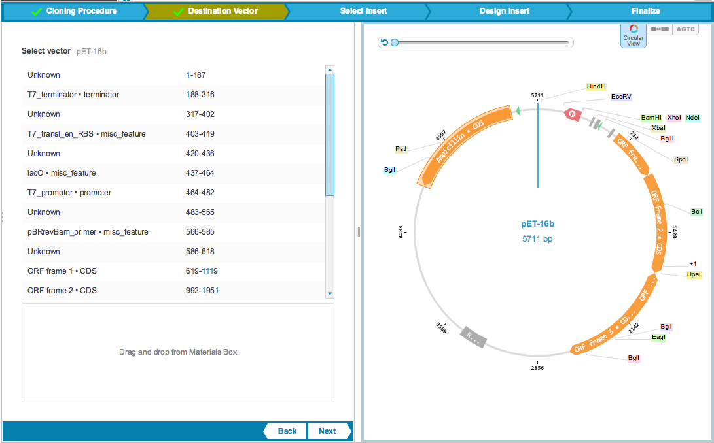

-   To select a vector, drag and drop a file from the Materials box
    (Figure [1.19.4.1](#x1-90001r1)). This section will already be
    filled if you selected your vector to open the Cloning Wizard.

    ------------------------------------------------------------------------

    

    
    
    

    Figure 1.19.4.1: The
    ”Destination Vector” tab.

    

    

    ------------------------------------------------------------------------

-   The vector will appear on the right, and its meta data will be
    displayed on the left (Figure [1.19.4.2](#x1-90002r2)).

    ------------------------------------------------------------------------

    

    
    
    

    Figure 1.19.4.2: The
    ”Destination Vector” tab.

    

    

    ------------------------------------------------------------------------
