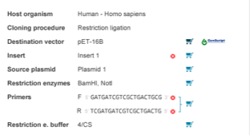
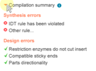

-   The ”Finalize” step displays a summary of the cloning procedure and
    allows you to add elements to your cart and select providers by
    clicking the ”Cart” icon (Figure [1.19.9.1](#x1-95001r1)). They can
    also be exported in text format for ease of copying and pasting into
    your preferred DNA synthesis providers website.

    ------------------------------------------------------------------------

    

    
    
    

    Figure 1.19.9.1: The
    cloning summary in the ”Finalize” tab.

    

    

    ------------------------------------------------------------------------

-   The ”Compilation summary” displays prospective Synthesis and Design
    errors (Figure [1.19.9.2](#x1-95002r2)).

    ------------------------------------------------------------------------

    

    
    
    

    Figure 1.19.9.2: The
    ”Compilation summary” drop down in the ”Finalize” tab.

    

    

    ------------------------------------------------------------------------

-   The final cloned product is visible on the right panel and the
    cloning minimap, displaying the inserted sequence inside the
    destination vector. Select ”Finish” to create your new cloning
    project.
