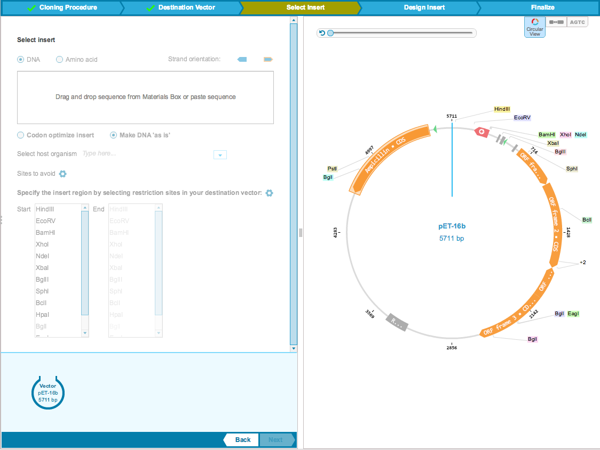
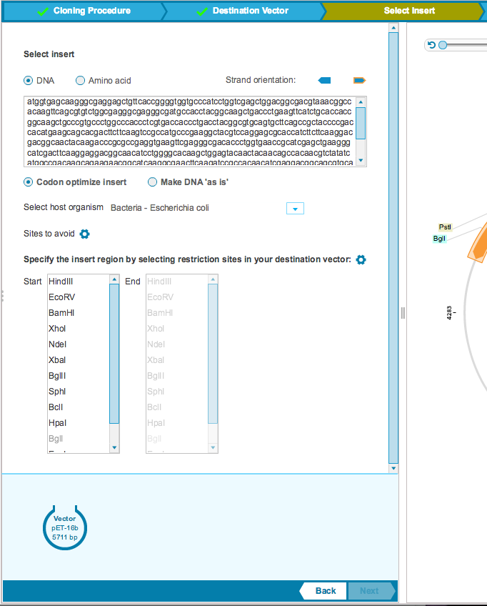
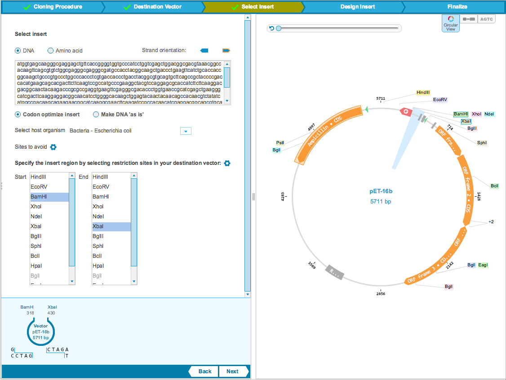

-   The ”Select Insert” step enables the selection of the insert
    sequence for cloning into the destination vector. You can choose to
    add an insert sequence of amino acids or DNA. To add your insert,
    drag and drop a file from the Materials box. You can reverse
    complement the sequence by selecting the other strand orientation
    (Figure [1.19.5.1](#x1-91001r1)). This section will already be
    filled if you selected your insert to open the Cloning Wizard.

    ------------------------------------------------------------------------

    

    
    
    

    Figure 1.19.5.1: The
    ”Select Insert” tab.

    

    

    ------------------------------------------------------------------------

-   You can codon optimize the insert or, in the case of a DNA
    insertion, choose to keep the DNA as it is. Select the appropriate
    option by checking its checkbox. If you would like to codon optimize
    the insert, select the host organism from the drop down menu. You
    can also select specific sites to avoid
    (Figure [1.19.5.2](#x1-91002r2)).

    ------------------------------------------------------------------------

    

    
    
    

    Figure 1.19.5.2: The
    ”Select Insert” tab: codon optimization.

    

    

    ------------------------------------------------------------------------

-   You will then need to specify the insert region by selecting
    restriction sites in the destination vector
    (Figure [1.19.5.3](#x1-91003r3)). You can configure the restriction
    site list by opening the restriction site dialog where a preset can
    be configured. Your desired sites preset will automatically be added
    to the ”start” and ”end” restriction sites list for you to select.
    The preset will also be displayed on the vector in the right panel.
    Single and double cutters in the destination vector will be shown in
    black and other enzymes will be greyed out. As the restriction sites
    are selected they will appear in the mining cloning map along the
    bottom of the left panel (Figure [1.19.5.3](#x1-91003r3)).

    ------------------------------------------------------------------------

    

    
    
    

    Figure 1.19.5.3: The
    ”Select Insert” tab: cut sites.

    

    

    ------------------------------------------------------------------------
