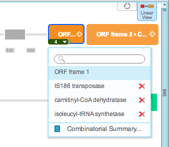

-   Drag and drop parts on the part that you would like to change. You
    can add part alternatives to as many different parts in the project
    as desired. The ”Translation Settings” dialog will pop up
    (Figure [1.15.1.1](#x1-73001r1)). You can choose to translate your
    sequence according to codon usage or to a translation table or to
    keep the DNA as original (more details about the translation feature
    can be found in section [1.14](#x1-680001.14)). In the example
    below, the sequence is translated according to codon usage in E.
    coli.

    ------------------------------------------------------------------------

    

    
    
    

    Figure 1.15.1.1: The
    “Translation Settings” dialog.

    

    

    ------------------------------------------------------------------------

-   A dropdown arrow will appear on the part. Click on it to see the
    dropdown menu showing all the different sequences
    (Figure [1.15.1.2](#x1-73002r2)). To view a summary of all
    combinations, click ”Combinatorial Summary...”.

    ------------------------------------------------------------------------

    

    
    
    

    Figure 1.15.1.2: The
    dropdown menu showing the different parts.

    

    

    ------------------------------------------------------------------------

-   The ”Combinatorial Summary - Parts” will appear
    (Figure [1.15.1.3](#x1-73003r3)). It displays the different
    combinations, which can be selected. You can choose which part to
    view in the main view by selecting it and clicking ”Set as Current”.
    Get a pricing of your projects by clicking ”Pricing”. The statistics
    of your selection are shown at the bottom of the dialog. On
    exhaustive mode, the library consists of all the possible
    combinations, whereas in one step mutation mode, the library
    consists of all combinations whereby only one alternative is
    replaced each time.

    ------------------------------------------------------------------------

    

    
    
    

    Figure 1.15.1.3: The
    ”Combinatorial Summary - Parts”.

    

    

    ------------------------------------------------------------------------
