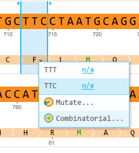
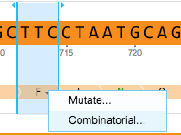
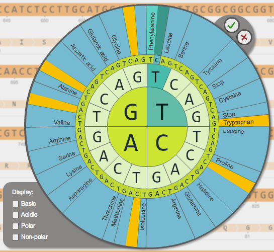
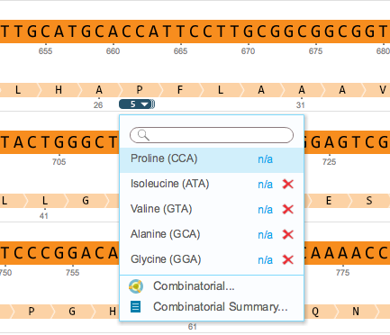
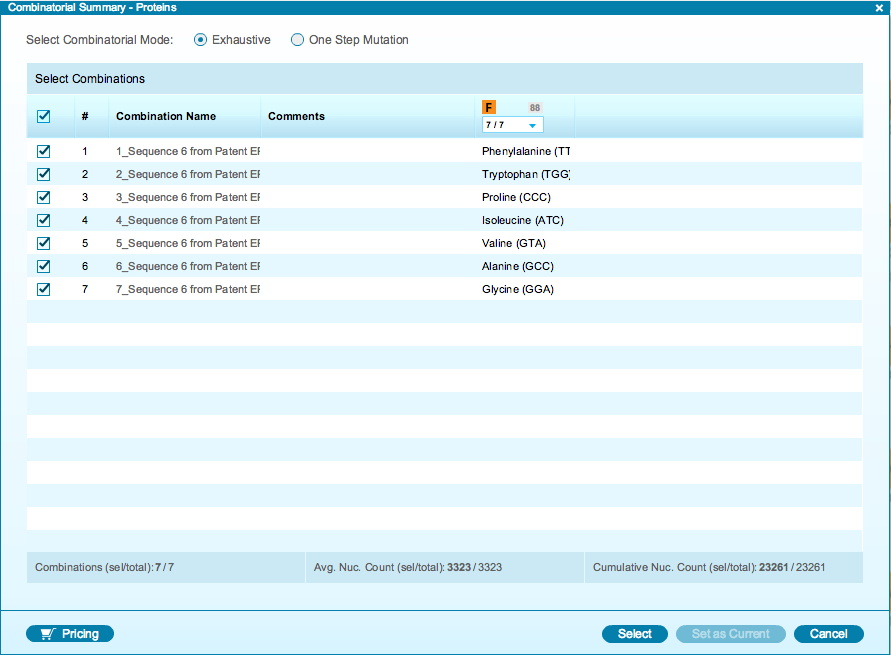

-   To test different amino acids on one location, either click the drop
    down arrow below the amino acid and select ”Combinatorial...”
    (Figure [1.15.2.1](#x1-74001r1)) or right click on the amino acid
    and select ”Combinatorial...” from the drop down menu
    (Figure [1.15.2.2](#x1-74002r2)). You can add amino acid
    alternatives to as many different amino acids in the part as
    desired.

    ------------------------------------------------------------------------

    

    
    
    

    Figure 1.15.2.1: ”Combinatorial...” in the drop down arrow
    menu.

    

    

    ------------------------------------------------------------------------

    ------------------------------------------------------------------------

    

    
    
    

    Figure 1.15.2.2: ”Combinatorial...” in the right click dropdown
    menu.

    

    

    ------------------------------------------------------------------------

-   Select amino acids from the combinatorial wheel
    (Figure [1.15.2.3](#x1-74003r3)) and click the green tick. You can
    filter selection of amino acids with a specific property by checking
    the property checkbox on the left.

    ------------------------------------------------------------------------

    

    
    
    

    Figure 1.15.2.3: The
    amino acids combinatorial wheel.

    

    

    ------------------------------------------------------------------------

-   A drop down arrow will appear on the amino acid. Click on it to see
    the drop down menu showing all the different amino acids
    (Figure [1.15.2.4](#x1-74004r4)). To view a summary of all
    combinations, click ”Combinatorial Summary...”.

    ------------------------------------------------------------------------

    

    
    
    

    Figure 1.15.2.4: The
    drop down menu showing the different amino acids.

    

    

    ------------------------------------------------------------------------

-   The ”Combinatorial Summary - Proteins” will appear
    (Figure [1.15.2.5](#x1-74005r5)). It has the same features as for
    parts.

    ------------------------------------------------------------------------

    

    
    
    

    Figure 1.15.2.5: The
    ”Combinatorial Summary - Proteins”.

    

    

    ------------------------------------------------------------------------
