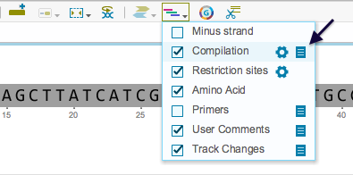
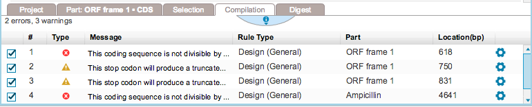

-   A summary of the errors and warnings in the project is displayed in
    the “Compilation” summary table (Figure [1.13.4.2](#x1-66002r2)) at
    the bottom of the screen. This table can be accessed by clicking the
    corresponding icon from the toolbar drop down Layers menu
    (Figure [1.13.4.1](#x1-66001r1)). You can remove the viewing of
    errors and warnings from the different abstraction layers views by
    unchecking the compilation box from the toolbar drop down Layers
    menu.

    ------------------------------------------------------------------------

    

    
    
    

    Figure 1.13.4.1: The
    ”Compilation” summary table icon in the toolbar drop down Layers
    menu.

    

    

    ------------------------------------------------------------------------

    ------------------------------------------------------------------------

    

    
    
    

    Figure 1.13.4.2: The
    ”Compilation” summary table.

    

    

    ------------------------------------------------------------------------
