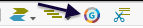
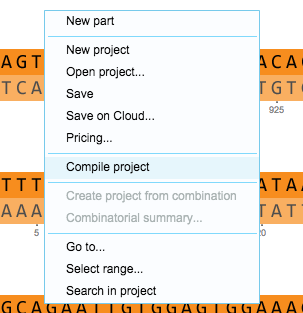

-   To compile your project, click the compilation icon in the toolbar
    (Figure [1.13.2.1](#x1-64001r1)), or right click on your project
    canvas and click “Compile project” (Figure [1.13.2.2](#x1-64002r2)).

    ------------------------------------------------------------------------

    

    
    
    

    Figure 1.13.2.1: The
    compilation icon in the toolbar.

    

    

    ------------------------------------------------------------------------

    ------------------------------------------------------------------------

    

    
    
    

    Figure 1.13.2.2: ”Compile project” in the right click drop down
    menu.

    

    

    ------------------------------------------------------------------------
