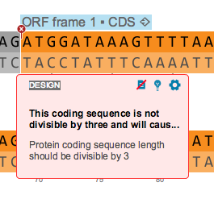
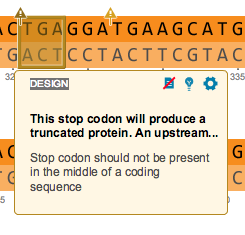

-   Errors and warnings correspond to violation of design rules. Errors
    (red X flags) and warnings (yellow exclamation mark flags) will
    appear in the sequence (Figure [1.13.3.2](#x1-65003r2)).

    ------------------------------------------------------------------------

    

    
      Error.  

      Warning.\

    

    Figure 1.13.3.2: Errors and warnings.

    

    

    ------------------------------------------------------------------------
