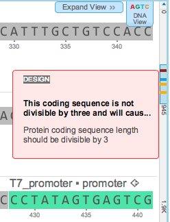

-   You can navigate to each error or warning in the DNA sequence by
    clicking the desired rule violation in the “Compilation” summary
    table (Figure [1.13.4.2](#x1-66002r2)) or by using the project
    scroll bar on the right (Figure [1.13.5.1](#x1-67001r1)).

    ------------------------------------------------------------------------

    

    
    
    

    Figure 1.13.5.1: The
    scroll bar allows navigation to the errors and warnings.

    

    

    ------------------------------------------------------------------------
