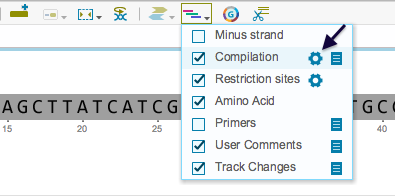
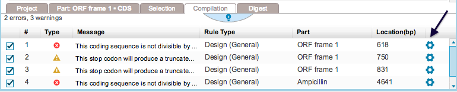
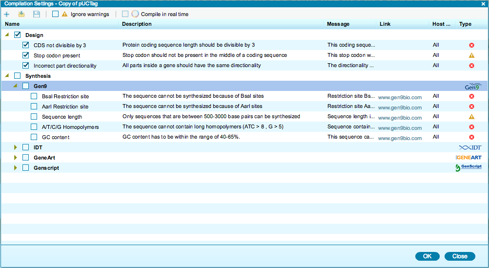

-   Before you start using the compilation engine, you should select the
    rules you would like to use. Rules can be selected from the
    “Compilation Settings” dialog (Figure [1.13.1.3](#x1-63003r3)). It
    can be accessed primarily by clicking on the corresponding
    “Settings” icon from the toolbar drop down Layers menu
    (Figure [1.13.1.1](#x1-63001r1)), or by clicking the “Settings” icon
    on the far right in the “Compilation” tab after a compilation has
    been carried out (Figure [1.13.1.2](#x1-63002r2)).

    ------------------------------------------------------------------------

    

    
    
    

    Figure 1.13.1.1: The
    ”Compilation Settings” dialog icon in the toolbar drop down Layers
    menu.

    

    

    ------------------------------------------------------------------------

    ------------------------------------------------------------------------

    

    
    
    

    Figure 1.13.1.2: ”Settings” icons in the ”Compilation” summary
    table.

    

    

    ------------------------------------------------------------------------

-   Rules are divided into two groups: “design rules” and “synthesis
    rules”. These are predefined design rules, as well as
    manufacturability rules specific to the main DNA synthesis
    providers. You can request a new rule by emailing one of our
    customer service representatives.
-   You can select the rules you would like to apply by checking and
    unchecking their box in the dialog (Figure [1.13.1.3](#x1-63003r3)).
-   To ignore warnings, simply click the “Ignore warnings” button at the
    top of the dialog box (Figure [1.13.1.3](#x1-63003r3)).

    ------------------------------------------------------------------------

    

    
    
    

    Figure 1.13.1.3: The
    “Compilation Settings” dialog.

    

    

    ------------------------------------------------------------------------
