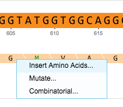

-   You can add amino acids in your projects. Right click on the amino
    acid after which you would like the amino acids to be added and
    select “Insert Amino Acids...” from the drop down menu
    (Figure [1.4.4.1](#x1-25001r1)).

    ------------------------------------------------------------------------

    

    
    
    

    Figure 1.4.4.1: ”Insert Amino Acids” in the right click drop down
    menu.

    

    

    ------------------------------------------------------------------------

-   The ”Insert Amino Acid” dialog will appear. Type in the amino acids
    (use the 1 letter representation).
-   The ”Translation Settings” dialog will appear. You can choose to
    translate according to codon usage or to a translation table. For
    more details about translation see section [1.14](#x1-680001.14).
