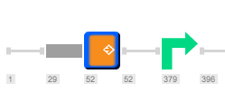

-   You can add new parts to your projects. Right click where you would
    like your new part to be and select “New part” from the drop down
    menu (Figure [1.4.3.1](#x1-24001r1)), or click the “Create New Part”
    icon in the toolbar (Figure [1.4.3.2](#x1-24002r2)).

    ------------------------------------------------------------------------

    

    
    
    

    Figure 1.4.3.1: ”New
    part” in the right click drop down menu.

    

    

    ------------------------------------------------------------------------

    ------------------------------------------------------------------------

    

    
    
    

    Figure 1.4.3.2: The
    ”New part” icon in the toolbar.

    

    

    ------------------------------------------------------------------------

-   This will create an empty part (Figure [1.4.3.3](#x1-24003r3)) which
    can be edited in the DNA view (Figure [1.4.3.4](#x1-24004r4)).

    ------------------------------------------------------------------------

    

    
    
    

    Figure 1.4.3.3: New
    empty part in the linear view.

    

    

    ------------------------------------------------------------------------

    ------------------------------------------------------------------------

    

    
    
    

    Figure 1.4.3.4: New
    empty part in the DNA view.

    

    

    ------------------------------------------------------------------------
