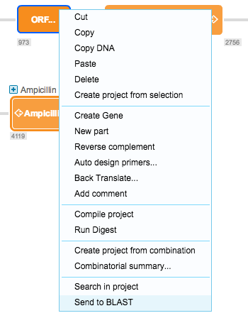

-   You can send sequences to Basic Local Alignment Search Tool (BLAST)
    directly from the software. Select a sequence in the DNA view or a
    part in the linear view, right click and select ”Send to BLAST” from
    the drop down menu (Figure [1.4.9.1](#x1-30001r1)).

    ------------------------------------------------------------------------

    

    
    
    

    Figure 1.4.9.1: ”Send
    to BLAST” in the right click drop down menu.

    

    

    ------------------------------------------------------------------------

-   This will open the BLAST website ([blast.ncbi.nlm.nih.gov](http://blast.ncbi.nlm.nih.gov))
    with the selected sequence pasted.
