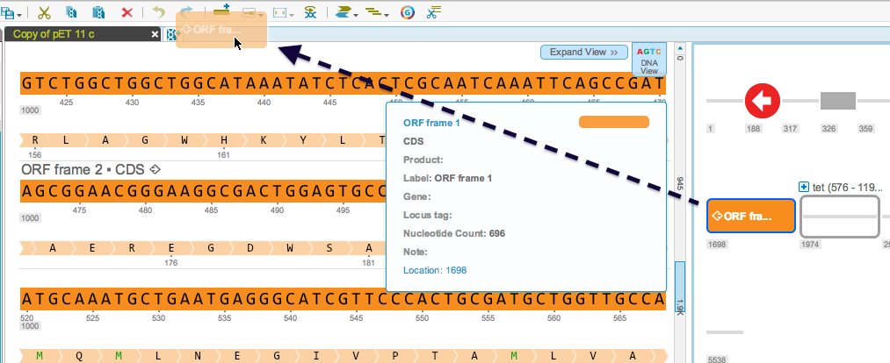
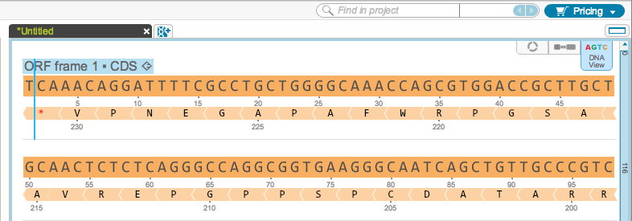

-   In addition to standard copy, cut, paste, delete, Genome Compiler
    also has drag and drop functionality.
-   You can drag and drop projects from the Materials box to open
    projects, or from open projects to other open projects.
-   You can also drag and drop parts, amino acids or base pairs within a
    project and between projects.
-   You can create a new project by dragging a selection to the toolbar
    (Figures [1.4.2.1](#x1-23001r1) and [1.4.2.2](#x1-23002r2)).

    ------------------------------------------------------------------------

    

    
    
    

    Figure 1.4.2.1: Drag
    and drop a selection to the toolbar to create a new project.

    

    

    ------------------------------------------------------------------------

    ------------------------------------------------------------------------

    

    
    
    

    Figure 1.4.2.2: New
    project created from a dropped selection.

    

    

    ------------------------------------------------------------------------
