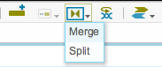
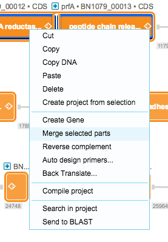
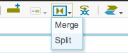
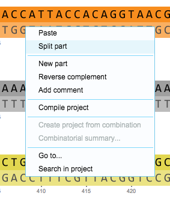

-   You can merge and split parts. To merge parts, select them and
    select “Merge” in the toolbar (Figure [1.4.6.1](#x1-27001r1)), or
    right click and select “Merge selected parts” from the drop down
    menu (Figure [1.4.6.2](#x1-27002r2)). A new merged part containing
    the selection will be created.

    ------------------------------------------------------------------------

    

    
    
    

    Figure 1.4.6.1: The
    ”Merge” icon in the toolbar.

    

    

    ------------------------------------------------------------------------

    ------------------------------------------------------------------------

    

    
    
    

    Figure 1.4.6.2: ”Merge
    selected parts” in the right click drop down menu.

    

    

    ------------------------------------------------------------------------

-   To split a sequence, switch to DNA view and place the caret where
    you would like to split the sequence. Select “Split” in the toolbar
    (Figure [1.4.6.3](#x1-27003r3)), or right click and select “Split
    part” from the dropdown menu (Figure [1.4.6.4](#x1-27004r4)). New
    split parts will be created.

    ------------------------------------------------------------------------

    

    
    
    

    Figure 1.4.6.3: The
    ”Split” icon in the toolbar.

    

    

    ------------------------------------------------------------------------

    ------------------------------------------------------------------------

    

    
    
    

    Figure 1.4.6.4: ”Split
    part” in the right click drop down menu.

    

    

    ------------------------------------------------------------------------
