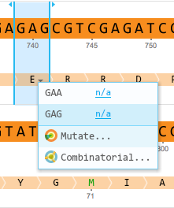
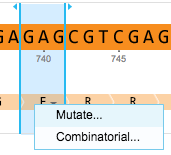
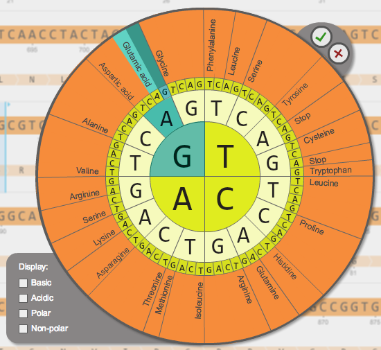

-   The mutation wheel allows you to mutate amino acids. To access the
    mutation wheel, click the drop down arrow below the amino acid and
    select ”Mutate...” (Figure [1.4.8.1](#x1-29001r1)) or right click on
    the amino acid and select ”Mutate...” from the drop down menu
    (Figure [1.4.8.2](#x1-29002r2)).

    ------------------------------------------------------------------------

    

    
    
    

    Figure 1.4.8.1: ”Mutate...” in the drop down arrow menu.

    

    

    ------------------------------------------------------------------------

    ------------------------------------------------------------------------

    

    
    
    

    Figure 1.4.8.2: ”Mutate” in the right click drop down menu.

    

    

    ------------------------------------------------------------------------

-   Select amino acids from the mutation wheel
    (Figure [1.4.8.3](#x1-29003r3)) and click the green tick. You can
    filter selection of amino acids with a specific property by checking
    the property checkbox on the left.

    ------------------------------------------------------------------------

    

    
    
    

    Figure 1.4.8.3: The
    amino acids mutation wheel.

    

    

    ------------------------------------------------------------------------
