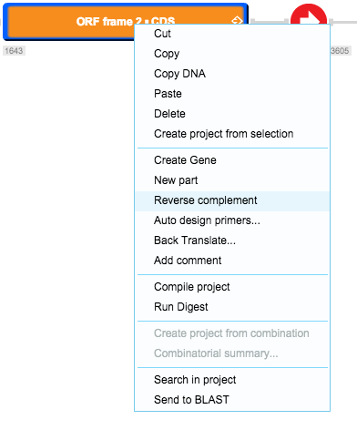

-   To perform a reverse complement, right click on the part and select
    “Reverse complement” from the drop down menu
    (Figure [1.4.5.1](#x1-26001r1)), or click the “Reverse Complement”
    icon in the toolbar (Figure [1.4.5.2](#x1-26002r2)).

    ------------------------------------------------------------------------

    

    
    
    

    Figure 1.4.5.1: ”Reverse complement” in the right click drop down
    menu.

    

    

    ------------------------------------------------------------------------

    ------------------------------------------------------------------------

    

    
    
    

    Figure 1.4.5.2: The
    ”Reverse Complement” icon in the toolbar.

    

    

    ------------------------------------------------------------------------
