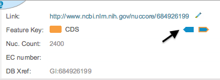
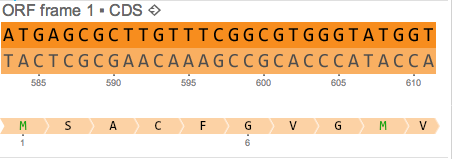
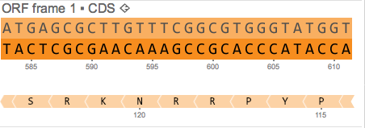
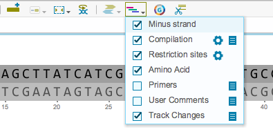

-   You can select DNA strands using the ”Minus strand” and ”Plus
    strand” icons in the ”Part” tab (Figure [1.4.7.1](#x1-28001r1)).

    ------------------------------------------------------------------------

    

    
    
    

    Figure 1.4.7.1: The
    ”Minus strand” and ”Plus strand” icons in the ”Part” tab.

    

    

    ------------------------------------------------------------------------

-   The selected strand will be indicated by a darker color, as well as
    identified by an arrow (Figure [1.4.7.3](#x1-28004r3)).

    ------------------------------------------------------------------------

    

    
      Plus strand
    selected.  

      Minus strand
    selected.\

    

    Figure 1.4.7.3: DNA
    strands visualization.

    

    

    ------------------------------------------------------------------------

-   You can show or unshow the minus strand by checking or unchecking
    the box in the toolbar drop down Layers menu
    (Figure [1.4.7.4](#x1-28005r4)).

    ------------------------------------------------------------------------

    

    
    
    

    Figure 1.4.7.4: The
    ”Minus Strand” checkbox in the toolbar drop down Layers menu.

    

    

    ------------------------------------------------------------------------
