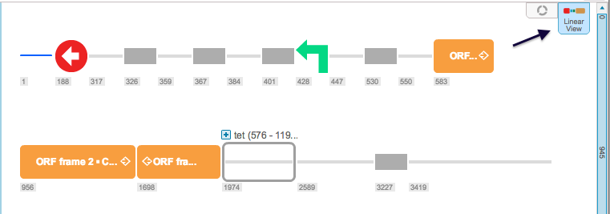
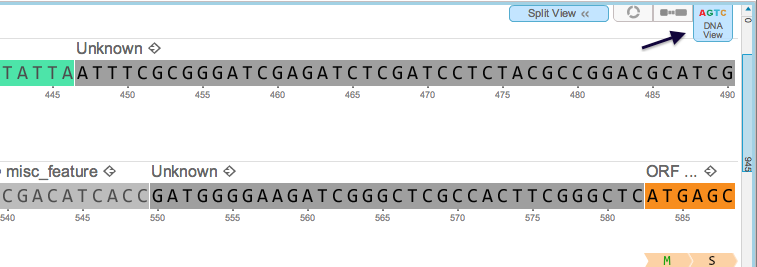
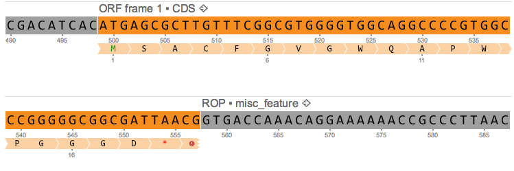
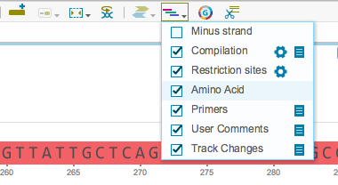

-   There are three abstraction layers: the circular view, the linear
    view and the DNA view. You can navigate to each layer view by
    clicking its icon (Figures [1.2.7.1](#x1-13001r1)
    and [1.2.7.2](#x1-13002r2)).

    ------------------------------------------------------------------------

    

    
    
    

    Figure 1.2.7.1: The
    linear view and its icon.

    

    

    ------------------------------------------------------------------------

    ------------------------------------------------------------------------

    

    
    
    

    Figure 1.2.7.2: The
    DNA view and its icon.

    

    

    ------------------------------------------------------------------------

-   The DNA view contains an amino acid layer
    (Figure [1.2.7.3](#x1-13003r3)). Methionine is shown in green, stop
    codons are represented by a red star, and incomplete amino acids are
    marked by a red exclamation point.

    ------------------------------------------------------------------------

    

    
    
    

    Figure 1.2.7.3: The
    amino acid layer in the DNA view.

    

    

    ------------------------------------------------------------------------

-   You can show or unshow the amino acid layer by checking or
    unchecking the box in the toolbar drop down Layers menu
    (Figure [1.2.7.4](#x1-13004r4)).

    ------------------------------------------------------------------------

    

    
    
    

    Figure 1.2.7.4: The
    ”Amino Acid” checkbox in the toolbar drop down Layers menu.

    

    

    ------------------------------------------------------------------------
