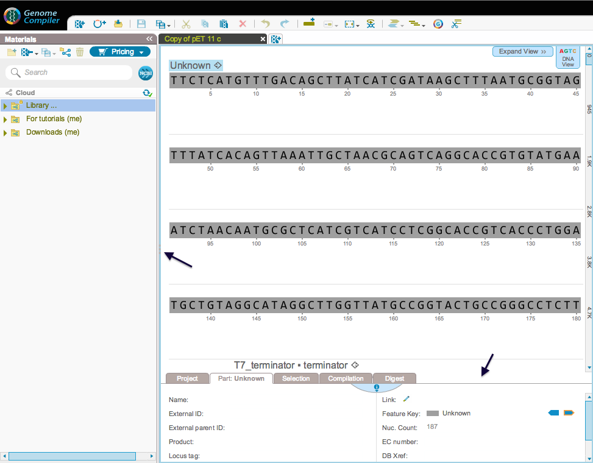
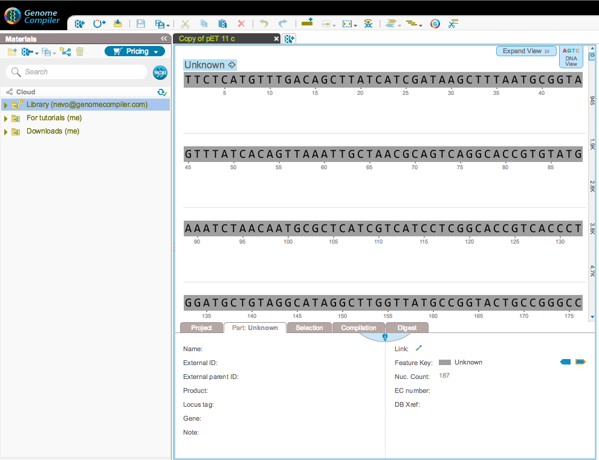

-   The Materials box and the properties section sizes can be adjusted
    (Figure [1.2.4.1](#x1-10001r1) and [1.2.4.2](#x1-10002r2)).

    ------------------------------------------------------------------------

    

    
    
    

    Figure 1.2.4.1: Buttons to adjust the size of the Materials box and
    the properties section.

    

    

    ------------------------------------------------------------------------

    ------------------------------------------------------------------------

    

    
    
    

    Figure 1.2.4.2: Enlarged Materials box and properties
    section.

    

    

    ------------------------------------------------------------------------
