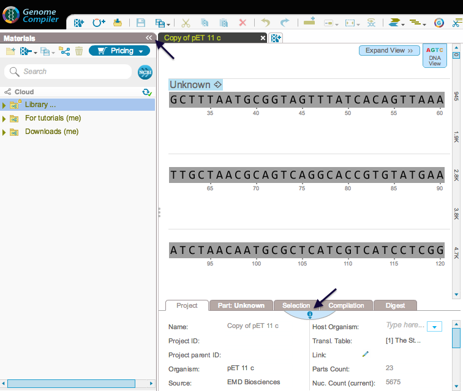
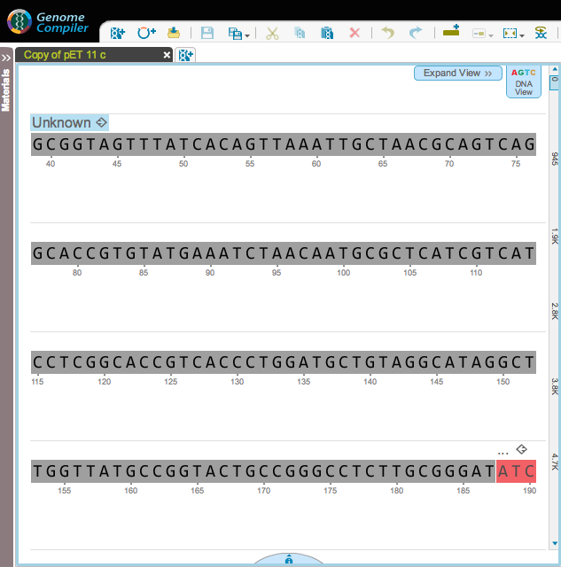

-   The Materials box and the properties section can be minimized by
    clicking the appropriate icon (Figures [1.2.3.1](#x1-9001r1)
    and [1.2.3.2](#x1-9002r2)).

    ------------------------------------------------------------------------

    

    
    
    

    Figure 1.2.3.1: Minimizing buttons for the Materials box and the
    properties section.

    

    

    ------------------------------------------------------------------------

    ------------------------------------------------------------------------

    

    
    
    

    Figure 1.2.3.2: Minimized Materials box and properties
    section.

    

    

    ------------------------------------------------------------------------
