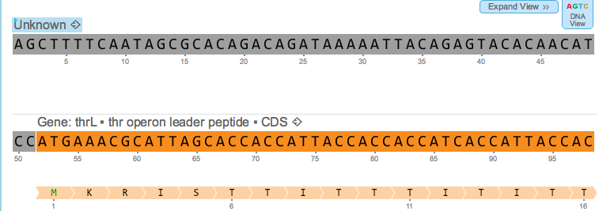
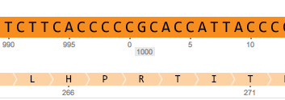
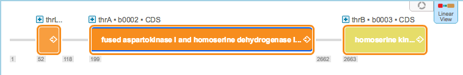

-   Base pairs and amino acids are numbered in the DNA view
    (Figure [1.2.8.1](#x1-14001r1)). After each thousand, counting
    starts again from 0 and a label indicates the current thousand
    (Figure [1.2.8.2](#x1-14002r2)).

    ------------------------------------------------------------------------

    

    
    
    

    Figure 1.2.8.1: Numbered base pairs and amino acids in the DNA
    view.

    

    

    ------------------------------------------------------------------------

-   After each thousand, counting starts again for base pairs from 0 and
    a label indicates the current thousand
    (Figure [1.2.8.2](#x1-14002r2)).

    ------------------------------------------------------------------------

    

    
    
    

    Figure 1.2.8.2: Numbered base pairs in the DNA view, after a
    thousand.

    

    

    ------------------------------------------------------------------------

-   The number of the first base pair of each part is indicated in the
    linear view (Figure [1.2.8.3](#x1-14003r3)).

    ------------------------------------------------------------------------

    

    
    
    

    Figure 1.2.8.3: The
    number of the first base pair of each part in the linear
    view.

    

    

    ------------------------------------------------------------------------
