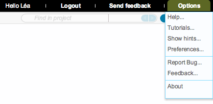
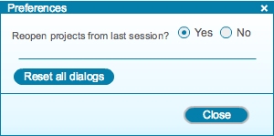

-   The ”Options” drop down menu at the top right
    (Figure [1.2.10.1](#x1-16001r1)) allows you to find information
    about the software, to give feedback and to access your preferences.

    ------------------------------------------------------------------------

    

    
    
    

    Figure 1.2.10.1: The
    ”Options” drop down menu.

    

    

    ------------------------------------------------------------------------

-   By default, projects left open in previous sessions are reopened in
    new sessions. This can be changed by selecting ”No” in the
    ”Preferences” dialog (Figure [1.2.10.2](#x1-16002r2)). You can also
    reset all dialogs by clicking ”Reset all dialogs”.

    ------------------------------------------------------------------------

    

    
    
    

    Figure 1.2.10.2: The
    ”Preferences” dialog.

    

    

    ------------------------------------------------------------------------
