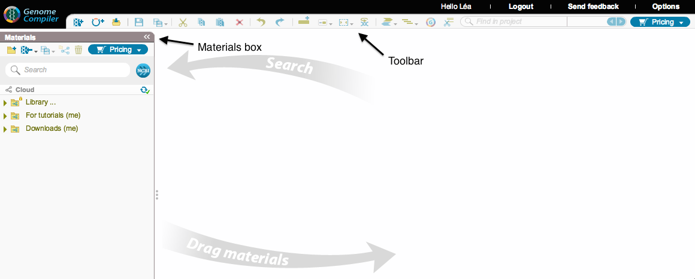
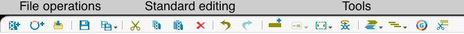
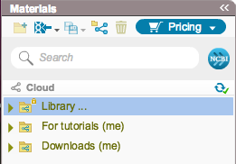
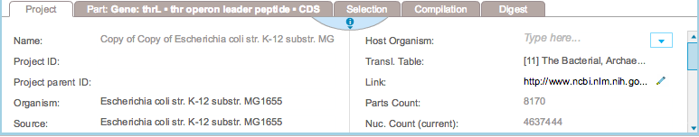

------------------------------------------------------------------------

Figure 1.2.1.1: General
view of the software.

------------------------------------------------------------------------

-   The toolbar at the top of the screen (Figure [1.2.1.2](#x1-7002r2))
    contains icons for file operations, standard editing (see
    section [1.4](#x1-210001.4)) and tools.

    ------------------------------------------------------------------------

    

    
    
    

    Figure 1.2.1.2: The
    toolbar.

    

    

    ------------------------------------------------------------------------

-   The Materials box on the left of the screen
    (Figure [1.2.1.3](#x1-7003r3)) gives you access to all your files.
    The search tool helps you find your files easily (see
    section [1.6](#x1-340001.6)). You can also use it to search through
    the NCBI database (see section [1.8](#x1-390001.8)). The Materials
    box provides a number of icons for file operations and tools.

    ------------------------------------------------------------------------

    

    
    
    

    Figure 1.2.1.3: The
    Materials box.

    

    

    ------------------------------------------------------------------------

-   The properties section at the bottom of the screen
    (Figure [1.2.1.4](#x1-7004r4)) contains different tabs providing
    information on your project, parts, selection, compilation and
    restriction digests (more information on the properties section can
    be found in section [1.2.9](#x1-150001.2.9)).

    ------------------------------------------------------------------------

    

    
    
    

    Figure 1.2.1.4: The
    properties section.

    

    

    ------------------------------------------------------------------------
