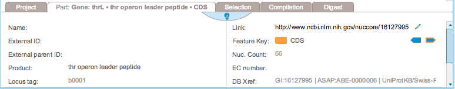
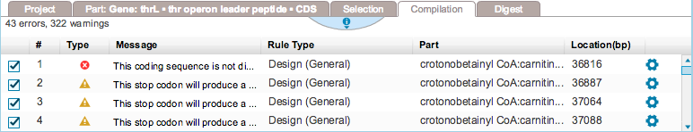
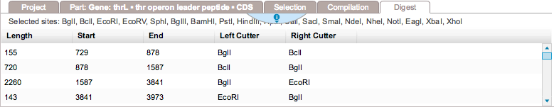
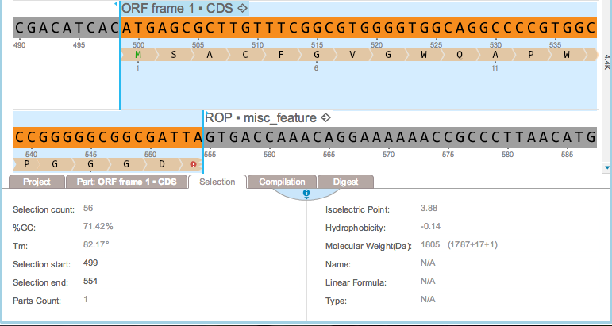

-   The properties section at the bottom of the screen contains
    different tabs providing information on your project
    (Figure [1.2.9.1](#x1-15001r1)), parts
    (Figure [1.2.9.2](#x1-15002r2)) (the tab is labeled ”Multiple” when
    multiple parts are selected), selection
    (Figure [1.2.9.5](#x1-15005r5)), compilation
    (Figure [1.2.9.3](#x1-15003r3)) and restriction digests
    (Figure [1.2.9.4](#x1-15004r4)).

    ------------------------------------------------------------------------

    

    
    
    

    Figure 1.2.9.1: The
    project tab.

    

    

    ------------------------------------------------------------------------

    ------------------------------------------------------------------------

    

    
    
    

    Figure 1.2.9.2: The
    part tab.

    

    

    ------------------------------------------------------------------------

    ------------------------------------------------------------------------

    

    
    
    

    Figure 1.2.9.3: The
    compilation tab.

    

    

    ------------------------------------------------------------------------

    ------------------------------------------------------------------------

    

    
    
    

    Figure 1.2.9.4: The
    digest tab.

    

    

    ------------------------------------------------------------------------

-   When you select a strand of DNA in the DNA view, the selection tab
    (Figure [1.2.9.5](#x1-15005r5)) displays:

    -   the selection count
    -   the GC content
    -   the melting temperature (calculated according to [SantaLucia
        1998](http://www.pnas.org/content/95/4/1460.full))
    -   the start of the selection
    -   the end of the selection
    -   the number of parts contained in the selection
    -   the isolelectric point
    -   the hydrophobicity
    -   the molecular weight

    as well as the name, linear formula and type of the amino acid, when
    a single amino acid is selected.

    ------------------------------------------------------------------------

    

    
    
    

    Figure 1.2.9.5: The
    selection tab.

    

    

    ------------------------------------------------------------------------
