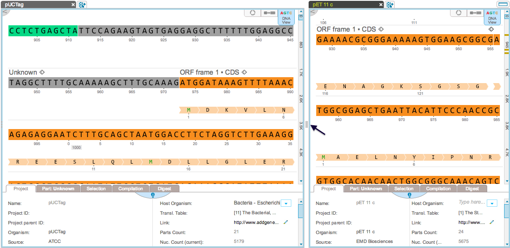
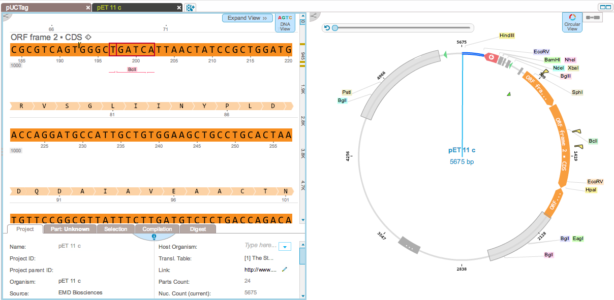
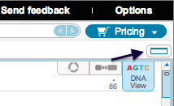
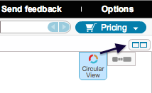

-   Project tabs can be moved and organized. When multiple projects are
    open, they can appear in two different views. In tile view, you can
    adjust the size of each project’s pane by moving the bar in between
    them (Figure [1.2.5.1](#x1-11001r1)).

    ------------------------------------------------------------------------

    

    
    
    

    Figure 1.2.5.1: Tile
    view with multiple projects.

    

    

    ------------------------------------------------------------------------

-   Alternatively, in full view, you can have only one project visible
    at a time. Navigate to each project by clicking the tab
    (Figure [1.2.5.2](#x1-11002r2)).

    ------------------------------------------------------------------------

    

    
    
    

    Figure 1.2.5.2: Full
    view with multiple projects.

    

    

    ------------------------------------------------------------------------

-   Navigate between both views by moving the tabs or by clicking the
    appropriate icon (Figure [1.2.5.4](#x1-11005r4)).

    ------------------------------------------------------------------------

    

    
      The swith to full view
    icon.  

      The switch to tile view
    icon.\

    

    Figure 1.2.5.4: Switch
    view icons.

    

    

    ------------------------------------------------------------------------
