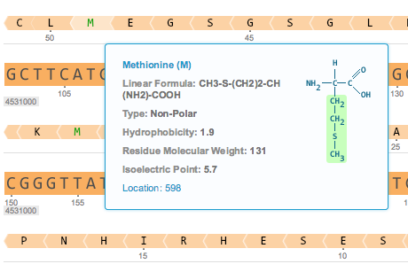

-   Many tooltips are available, describing dialogs, icons, etc. Simply
    hover over the item to see the tooltip. For example, information
    regarding the amino acids is displayed when you hover over them
    (Figure [1.2.2.1](#x1-8001r1)).

    ------------------------------------------------------------------------

    

    
    
    

    Figure 1.2.2.1: The
    tooltip describing the amino acids.

    

    

    ------------------------------------------------------------------------
