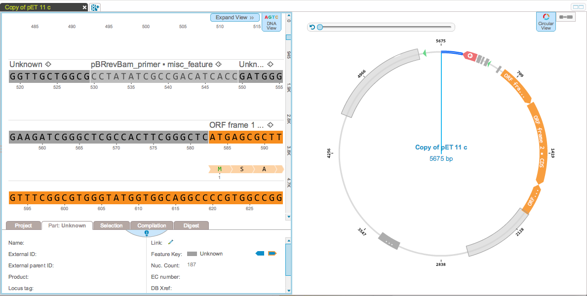
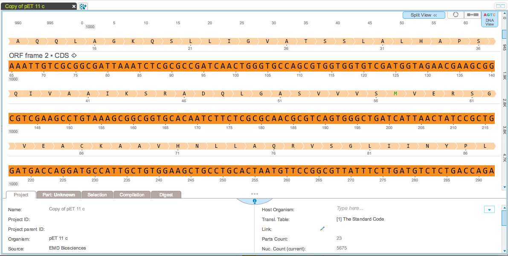
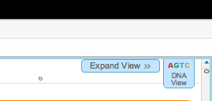
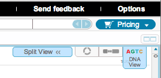

-   You can choose between two different views to visualize projects.
    The split view shows DNA on the left pane and the circular or linear
    view on the right pane (Figure [1.2.6.1](#x1-12001r1)).
    Alternatively, the expanded view allows you to select one view which
    fills the whole screen (Figure [1.2.6.2](#x1-12002r2)).

    ------------------------------------------------------------------------

    

    
    
    

    Figure 1.2.6.1: The
    split view.

    

    

    ------------------------------------------------------------------------

    ------------------------------------------------------------------------

    

    
    
    

    Figure 1.2.6.2: The
    expanded view.

    

    

    ------------------------------------------------------------------------

-   Navigate between the views using the ”Expand View” and ”Split View”
    buttons (Figure [1.2.6.4](#x1-12005r4)).

    ------------------------------------------------------------------------

    

    
      The ”Expand View”
    button.  

      The ”Split View”
    button.\

    

    Figure 1.2.6.4: Switch
    view icons.

    

    

    ------------------------------------------------------------------------
