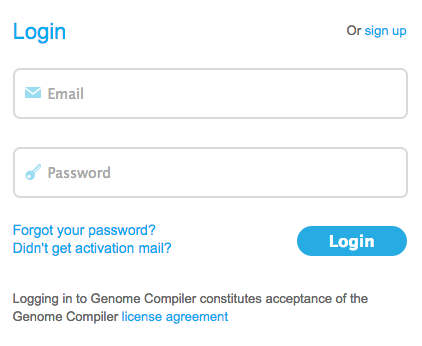

-   Once you have an account, simply login at [designer.genomecompiler.com](https://designer.genomecompiler.com/)
    (Figure [1.1.2.1](#x1-5001r1)).

    ------------------------------------------------------------------------

    

    
    
    

    Figure 1.1.2.1: Logging in to Genome Compiler.

    

    

    ------------------------------------------------------------------------

-   You are now ready to go! Check out the rest of the manual to learn
    more about the different features of our software.
