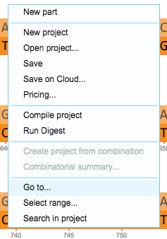
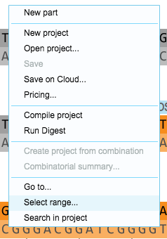

To open the “Go to” dialog, right click on your project canvas in the
protein or DNA view and select “Go to…” or “Select range…”
(Figure [1.5.1.2](#x1-32003r2)), or use the keyboard shortcut ”control
G”.

------------------------------------------------------------------------

  ”Go to...”  

  ”Select range...”\

Figure 1.5.1.2: ”Go to...”
and ”Select range...” in the right click drop down menu.

-   

    ------------------------------------------------------------------------
