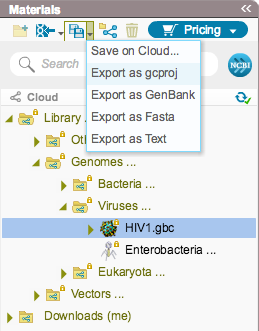
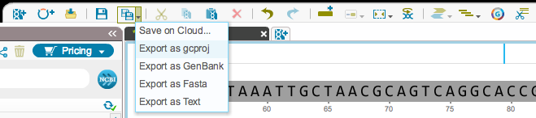

-   To export a file, select it and select the appropriate file format
    from the “Export” drop down menu in the Materials box
    (Figures [1.3.3.1](#x1-20001r1)) or in the toolbar
    (Figures [1.3.3.2](#x1-20002r2)). A dialog will pop up to prompt you
    for a name and a location.

    ------------------------------------------------------------------------

    

    
    
    

    Figure 1.3.3.1: The
    “Export” drop down menu in the Materials box.

    

    

    ------------------------------------------------------------------------

    ------------------------------------------------------------------------

    

    
    
    

    Figure 1.3.3.2: The
    “Export” drop down menu in the toolbar.

    

    

    ------------------------------------------------------------------------
