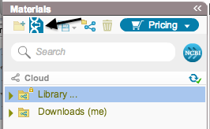
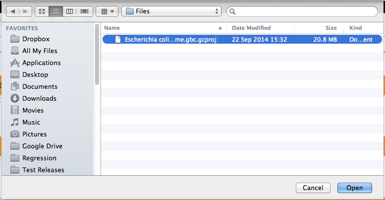
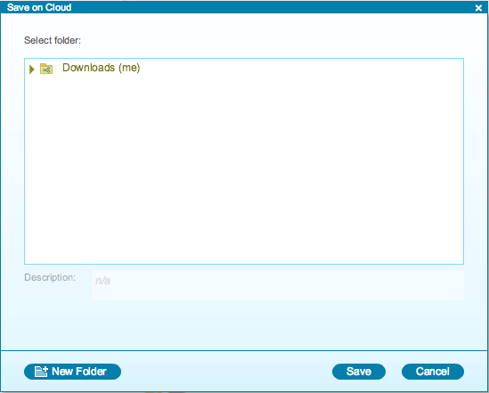
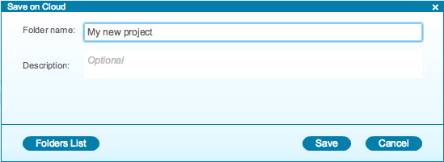

-   To import a file, click the “Import File” icon in the Materials box
    (Figure [1.3.1.1](#x1-18001r1)).

    ------------------------------------------------------------------------

    

    
    
    

    Figure 1.3.1.1: The
    ”Import File” icon in the Materials box.

    

    

    ------------------------------------------------------------------------

-   A dialog will pop up (Figure [1.3.1.2](#x1-18002r2)) to allow you to
    choose the file from your computer files.

    ------------------------------------------------------------------------

    

    
    
    

    Figure 1.3.1.2: Choosing a file from your computer files.

    

    

    ------------------------------------------------------------------------

-   Once you selected a file, a dialog will pop up
    (Figure [1.3.1.3](#x1-18003r3)) to prompt you for a location. You
    can choose to save the file in an existing folder or to create a new
    folder.

    ------------------------------------------------------------------------

    

    
    
    

    Figure 1.3.1.3: The
    ”Save on Cloud” dialog when importing a file.

    

    

    ------------------------------------------------------------------------

-   To create a new folder, click “New Folder”. A dialog will pop up
    (Figure [1.3.1.4](#x1-18004r4)) to prompt you for a name and an
    optional folder description. Save your file by clicking “Save”. The
    file will now be saved as a new project in Genome Compiler and can
    be opened from the Materials box.

    ------------------------------------------------------------------------

    

    
    
    

    Figure 1.3.1.4: The
    ”Save on Cloud” dialog when creating a new folder.

    

    

    ------------------------------------------------------------------------
