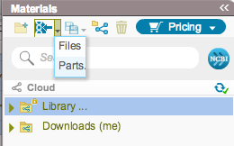
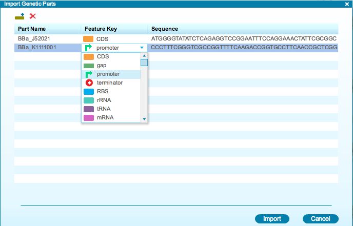

-   To import a part, select “Parts” from the import drop down menu
    (Figure [1.3.2.1](#x1-19001r1)).

    ------------------------------------------------------------------------

    

    
    
    

    Figure 1.3.2.1: The
    import drop down menu in the Materials box.

    

    

    ------------------------------------------------------------------------

-   The “Import Genetic Parts” dialog will appear
    (Figure [1.3.2.2](#x1-19002r2)). The “Create New Part” icon allows
    you to add a new part to the list. Select the appropriate feature
    from the “Feature Key” drop down menu and enter the part name and
    sequence. Click the “Delete” icon to delete a part.

    ------------------------------------------------------------------------

    

    
    
    

    Figure 1.3.2.2: The
    ”Import Genetic Parts” dialog and its ”Feature Key” drop down
    menu.

    

    

    ------------------------------------------------------------------------

-   Import the listed parts by clicking “Import”. The flow for saving
    parts is the same for saving files. Just like imported files, the
    imported part is saved as a new project in the Materials box.
