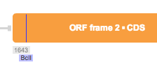

-   To open the “Restriction Sites” dialog, click on the Layers menu in
    the toolbar and select the “Restriction sites” settings from the
    drop down menu (Figure [1.16.1.1](#x1-76001r1)). Selected cut sites
    will be visible throughout the different abstraction layers views
    (Figure [1.16.1.3](#x1-76005r3)). To remove them from the views,
    uncheck the corresponding checkbox in the Layers menu.

    ------------------------------------------------------------------------

    

    
    
    

    Figure 1.16.1.1: The
    ”Restriction Sites” settings icon in the toolbar drop down Layers
    menu.

    

    

    ------------------------------------------------------------------------

    ------------------------------------------------------------------------

    

    
      Circular view.  

      Linear view.  

      DNA view.\

    

    Figure 1.16.1.3: Cut
    sites in the different views.

    

    

    ------------------------------------------------------------------------
