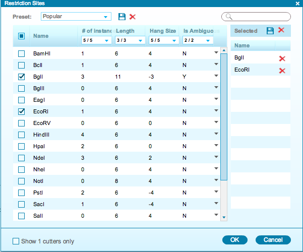
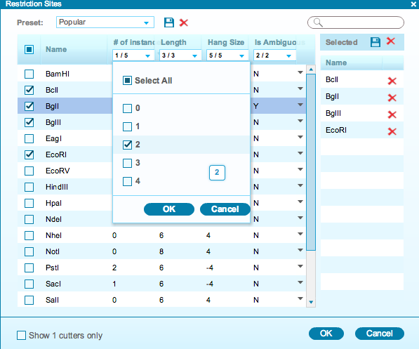
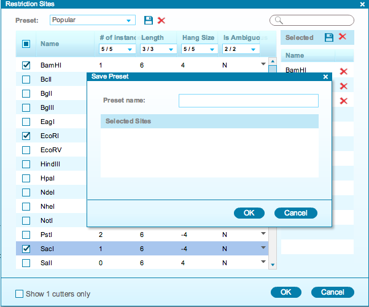
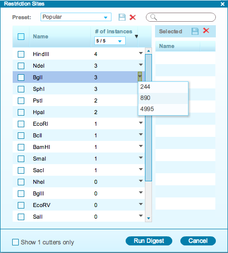

-   The “Restriction Site” settings dialog
    (Figure [1.16.2.1](#x1-77001r1)) will appear, displaying the
    following information about the restriction enzymes:
    -   Number of cuts in the project
    -   Length of the recognition sequence
    -   Hang size
    -   Ambiguity, i.e. whether different sequences can be recognized by
        the enzyme
-   In order to display the restriction enzymes cut sites in the
    project, select the check box for each enzyme in the main table and
    they will be automatically added to the ”Selected” list on the
    right. You can remove enzymes from the list by unchecking their
    checkbox or clicking on their “Delete” icon.

    ------------------------------------------------------------------------

    

    
    
    

    Figure 1.16.2.1: The
    ”Restriction Sites” settings dialog.

    

    

    ------------------------------------------------------------------------

-   The drop down menu from each column heading can be used to filter
    your enzyme selection. In the example below
    (Figure [1.16.2.2](#x1-77002r2)), we selected for double cutters
    only, so that only double cutters will appear on the list.

    ------------------------------------------------------------------------

    

    
    
    

    Figure 1.16.2.2: Example: show double cutters only.

    

    

    ------------------------------------------------------------------------

-   The “Preset” drop down menu allows you to switch between presets. To
    create a new preset, select restriction enzymes (they will appear on
    the right) and click save. A dialog will pop up
    (Figure [1.16.2.3](#x1-77003r3)) to prompt you for a new ”Preset
    name”. To delete a preset, click the corresponding delete icon .

    ------------------------------------------------------------------------

    

    
    
    

    Figure 1.16.2.3: The
    ”Save Preset” dialog (forefront).

    

    

    ------------------------------------------------------------------------

-   The small drop down arrow at the far right of the main table for
    each enzyme displays the restriction site locations
    (Figure [1.16.2.4](#x1-77004r4)). Clicking on the locations will
    take you to the corresponding area in the sequence view and
    highlight the location in the plasmid view.

    ------------------------------------------------------------------------

    

    
    
    

    Figure 1.16.2.4: The
    ”Restriction Sites” dialog: locations of the restriction
    sites.

    

    

    ------------------------------------------------------------------------

-   If you check the “Show 1 cutters only” box at the bottom left, only
    1 cutters will be visible throughout the different views.
