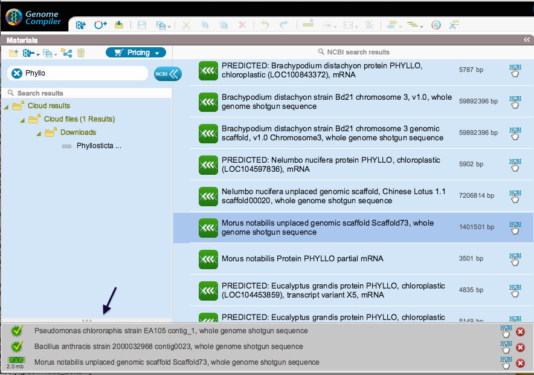

-   Downloaded and downloading files appear in a window at the bottom
    (Figure [1.8.2.1](#x1-41001r1)). You can remove files from the list
    by clicking the “remove” icon. The “view in NCBI” icon takes you to
    the corresponding page on the NCBI website. Click the “view in the
    Materials box” icon on the left of the downloaded project to view
    the file in the Materials box.

    ------------------------------------------------------------------------

    

    
    
    

    Figure 1.8.2.1: The
    downloaded and downloading files window.

    

    

    ------------------------------------------------------------------------
