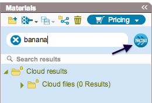
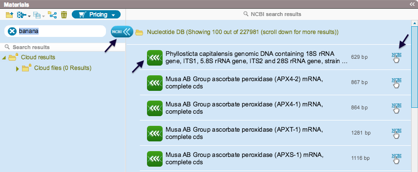
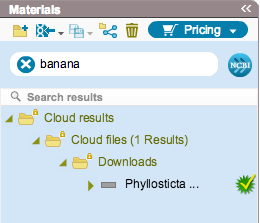

-   Type a keyword in the search bar and click the NCBI icon
    (Figure [1.8.1.1](#x1-40001r1)).

    ------------------------------------------------------------------------

    

    
    
    

    Figure 1.8.1.1: The
    NCBI icon and the search bar in the Materials box.

    

    

    ------------------------------------------------------------------------

-   NCBI search results will appear (Figure [1.8.1.2](#x1-40002r2)). The
    icon on the right of each result takes you to the NCBI website. To
    download the file, click the green “import” icon. To close the NCBI
    search results, click the NCBI icon.

    ------------------------------------------------------------------------

    

    
    
    

    Figure 1.8.1.2: NCBI
    search results, with - from left to right - the NCBI icon, the green
    ”import” icon and the ”See item in the NCBI website” icon.

    

    

    ------------------------------------------------------------------------

-   The downloaded file will be automatically added to the cloud in the
    Materials box (Figure [1.8.1.3](#x1-40003r3)).

    ------------------------------------------------------------------------

    

    
    
    

    Figure 1.8.1.3: The
    downloaded file in the Materials box.

    

    

    ------------------------------------------------------------------------

-   If you have already found what you are looking for in the NCBI
    database, you can copy the name or the GI number, and paste it in
    the search bar (Figure [1.8.1.1](#x1-40001r1)). Click the NCBI icon,
    and download the file.
