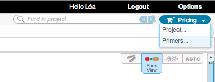
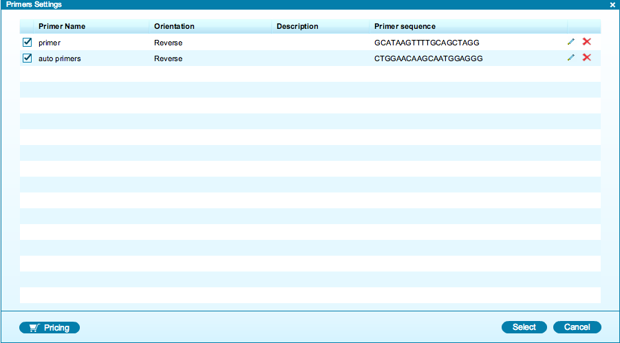
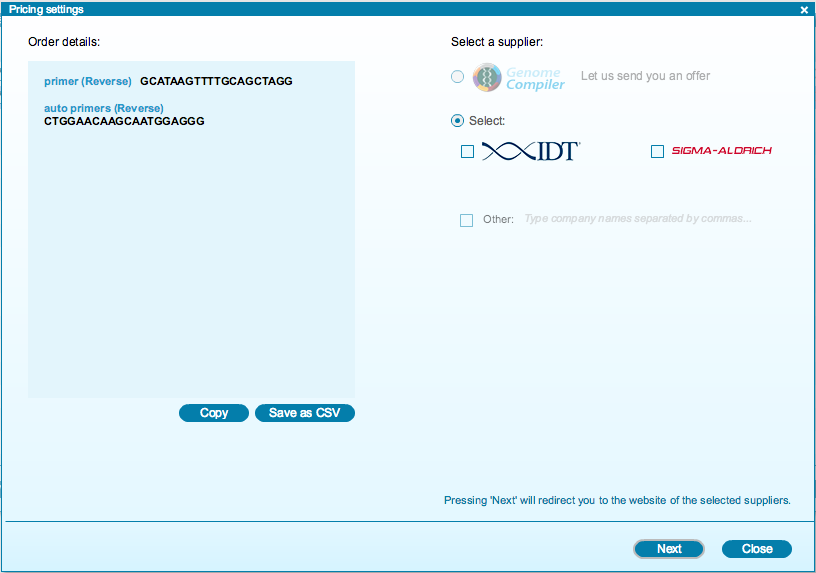

-   To get pricing for primers, go to the ”Pricing” icon in the toolbar
    and click ”Primers...” (Figure [1.12.2.1](#x1-61001r1)).

    ------------------------------------------------------------------------

    

    
    
    

    Figure 1.12.2.1: ”Primers” in the ”Pricing” drop down menu in the
    toolbar.

    

    

    ------------------------------------------------------------------------

-   The ”Primers settings” dialog will appear
    (Figure [1.12.2.2](#x1-61002r2)). Select the primers you would like
    to order from the list and click ”Pricing”.

    ------------------------------------------------------------------------

    

    
    
    

    Figure 1.12.2.2: The
    ”Primers settings” dialog.

    

    

    ------------------------------------------------------------------------

-   The ”Pricing settings” dialog will appear
    (Figure [1.12.2.3](#x1-61003r3)). Select a supplier from the list
    and click ”Next”. This will redirect you to the website of the
    selected supplier.

    ------------------------------------------------------------------------

    

    
    
    

    Figure 1.12.2.3: The
    ”Pricing settings” dialog for primers.

    

    

    ------------------------------------------------------------------------
